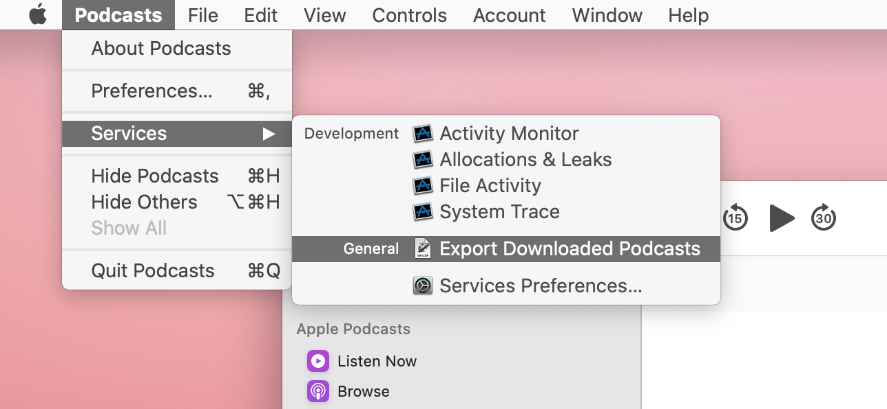

# Export downloaded episodes from Apple Podcasts

Douglas Watson, 2020, MIT License.

This script finds all downloaded episodes in Apple Podcasts on macOS Catalina and copies them to a folder, setting ID3 tags in the process. It is only meant to be executed within an Automator workflow, but if you want to run it from the shell:

```
pip install mutagen
python podcasts_export.py DESTINATION_FOLDER
```

On vanilla MacOS you may need to run:
```
pip3 install mutagen
python3 podcasts_export.py DESTINATION_FOLDER
```

You can also install the workflow directly, by unzipping then opening [Export Downloaded Podcasts.zip](Export%20Downloaded%20Podcasts.zip). This should create a new Service within the Podcasts app:



The workflow first prompts you for a destination folder, then executes the script. The first time it runs, it may prompt you for a password in order to install the mutagen python library, used for tagging the MP3 files.